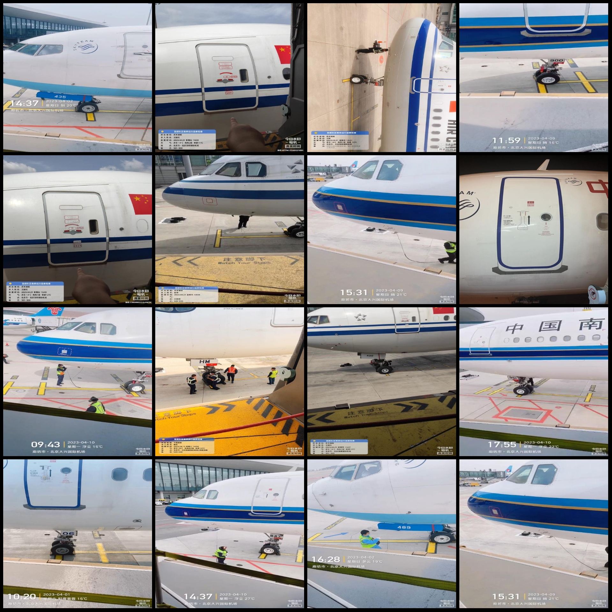
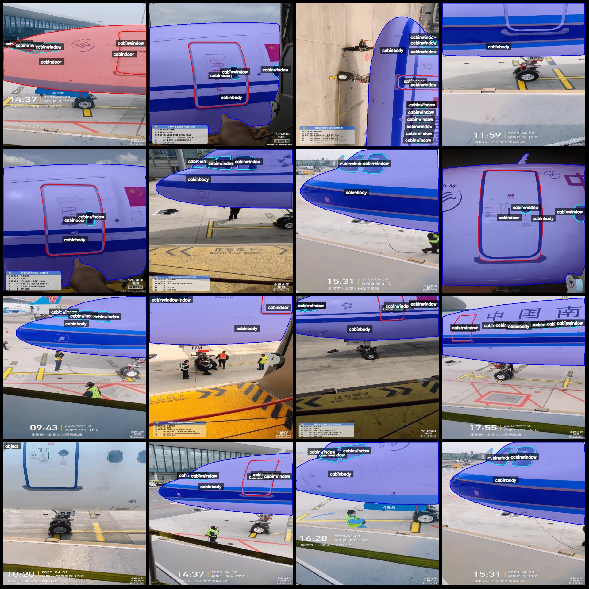
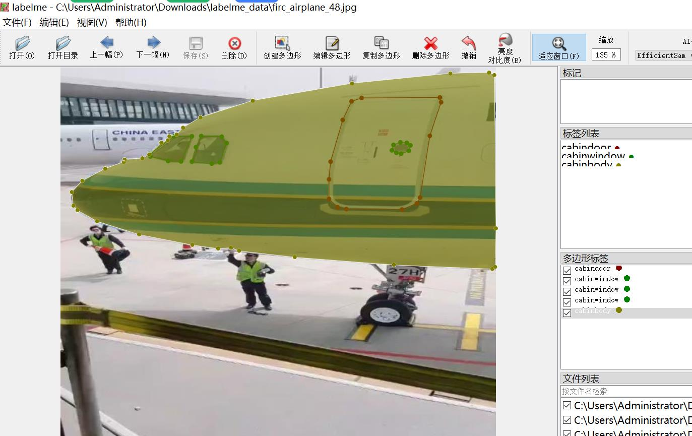

# Airplane Component Identification and Segmentation Data Set in LabelMe Format: 982 Categories

Dataset Format: LabelMe format (excluding mask files, only containing jpg images and corresponding json files).
Number of images (JPG file count): 982
Number of annotations (JSON file count): 982
Number of categories: 4
Annotation category names: ["cabindoor", "cabinwindow", "cabinbody", "object"]
Count of boxes per category:
- Cabindoor (Driver's Door) count = 478
- Cabinwindow (Driver's Window) count = 2954
- Cabinbody (Driver's Body) count = 742
- Object (Object) count = 222
Total box count: 4396

Annotation Tool: labelme=5.5.0
Image resolution: 640x640
Annotation rules: Polygon drawing for each category
Important Note: This dataset can be opened and edited using LabelMe; JSON datasets require conversion to either Mask or Yolo format or COCO format for semantic segmentation or instance segmentation.
Special Remark: This dataset does not guarantee the accuracy of the trained model or weight files.
Image Preview:
Randomly selected 16 images:
Annotation rendering results:
Annotation examples:

## Images

Here is a pay link on Stripe ( https://buy.stripe.com/3cs8yP7sY87d0vu9AB ). Please contact me lonlonago@foxmail.com after funding $89, and I will send you a complete data files , thank you!

